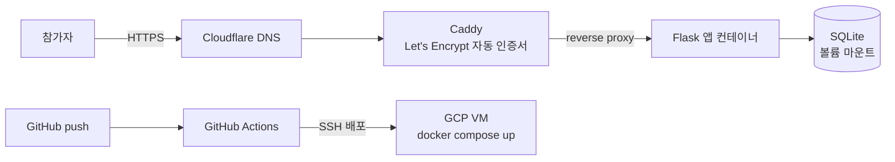

# CTF Memo Lab

공격하고 방어해 보는 **CTF형 보안 실습용 메모 웹앱**입니다.
Flask로 직접 만들어 클라우드에 배포했고, 실제 참가자들이 계정을 탈취하며 플래그를 찾는 게임으로 운영했습니다.

- 기간: 2026.09.15 ~ 09.16 (개인)
- 배경: 기업수요기반 화이트 해커 양성과정 실습

## 운영 결과

| 항목 | 결과 |
|---|---|
| 참가 계정 | 약 10개 |
| 플래그 제출 | 36회 |
| 최종 플래그 획득 | 1명 (관리자 계정을 탈취해 First Blood) |
| 관찰된 공격 | SQL 인젝션 5종(`' OR '1'='1`, `UNION SELECT` 등), SSTI(`{{7*7}}`), API ID 무작위 조회 |
| 미끼 효과 | 가짜 플래그 제출 여러 건 — 확인 없이 제출하는 참가자를 걸러냄 |

SQL 인젝션과 SSTI 시도는 모두 통하지 않았고, 설계한 경로로만 플래그를 얻을 수 있었습니다.

## 구조



## 주요 기능

- **회원 / 인증**: 회원가입, 로그인, 세션 기반 인증, 관리자 페이지
- **메모 CRUD**: HTML 화면과 JSON API(`/api/notes`)를 모두 제공
- **CTF 게임**: 3단계 플래그(쉬움 30점 / 중간 50점 / 최종 100점), 제출과 자동 채점, 점수판

## 보안 설계

의도한 취약점 외에는 일반적인 공격이 통하지 않도록 방어했습니다.

| 위협 | 대응 |
|---|---|
| SQL 인젝션 | 사용자 입력이 들어가는 모든 쿼리를 파라미터 바인딩으로 처리 |
| SSTI | 사용자 입력을 템플릿 엔진으로 렌더링하지 않음 |
| XSS | 사용자 입력 출력 시 `escape()` 처리 |
| CSRF | 상태를 바꾸는 모든 POST 요청에 세션 토큰 검증 |
| 세션 탈취 | `HttpOnly`, `SameSite=Lax` 쿠키 |
| 클릭재킹 | `X-Frame-Options: DENY` |
| 로그인 무차별 대입 | IP + 아이디 기준 5회 실패 시 60초 잠금 (아이디만 알아서는 다른 사용자를 잠글 수 없게 함) |
| API 남용 | 메모 조회 API 속도 제한(10초에 15회 초과 시 429), 입력 길이 제한 |
| 소유권 검증 | 다른 사람의 메모 요청 시 403이 아닌 404를 반환해 존재 여부를 숨김 |
| 비밀정보 노출 | `SECRET_KEY`, 관리자 비밀번호, 플래그를 환경변수로 분리. DB·로그는 커밋 제외 |
| 비밀번호 저장 | Werkzeug 해시 |

## CTF 설계

- **단계형 공격 경로**: 정보 노출 → 약한 계정 탈취 → 권한 상승 순서로 진행되며, 단계마다 플래그가 있습니다.
- **미끼**: 관리자처럼 보이지만 권한이 없는 계정, 평범한 제목 사이에 섞인 가짜 플래그를 두었습니다. 가짜 플래그를 제출하면 감점됩니다.
- **API 무작위 조회 함정**: 짧은 시간 안에 다른 사람의 메모 ID를 여러 개 훑으면 자동 감점됩니다.
- **점수판 노출 제한**: 제출 기록이 있는 계정만 표시해, 점수판만 보고 계정 이름을 알아낼 수 없게 했습니다.

## 기술 스택

Python · Flask · SQLite · Docker / Docker Compose · Caddy · GCP Compute Engine · Cloudflare · GitHub Actions

## 실행 방법

### 환경변수

`.env` 파일에 아래 값을 채워주세요.

```
SECRET_KEY=랜덤한_긴_문자열
ADMIN_PASSWORD=관리자_비밀번호
EASY_FLAG_CONTENT=SBOB{쉬운_단계_플래그}
MID_FLAG_CONTENT=SBOB{중간_단계_플래그}
ADMIN_MEMO_CONTENT=SBOB{최종_플래그}
```

`SECRET_KEY`는 아래 명령으로 만들 수 있습니다.

```
python3 -c "import secrets; print(secrets.token_hex(32))"
```

값을 채우지 않으면 코드의 기본값(플레이스홀더)으로 실행되고, 서버 시작 시 경고가 출력됩니다.

### Docker (권장)

```
docker compose up -d --build
```

- 데이터는 `./data/memo.db`에 저장되며, 컨테이너를 다시 올려도 유지됩니다.
- `Caddyfile`의 도메인을 본인 도메인으로 바꾸면 HTTPS가 자동으로 적용됩니다.

초기화하려면:

```
docker compose down
rm -rf ./data
docker compose up -d --build
```

### 로컬

```
python3 -m venv .venv
./.venv/bin/pip install flask
export $(grep -v '^#' .env | xargs)
./.venv/bin/python app.py
```

- 기본 주소: `http://127.0.0.1:8000`
- 외부 접속은 `HOST=0.0.0.0`, 포트 변경은 `PORT=원하는포트`를 앞에 붙여 실행하세요.

### 배포

`main` 브랜치에 push하면 GitHub Actions가 GCP VM에 SSH로 접속해 `git pull` 후 `docker compose up -d --build`를 실행합니다.
필요한 Secrets: `GCP_HOST`, `GCP_USER`, `GCP_SSH_KEY`
